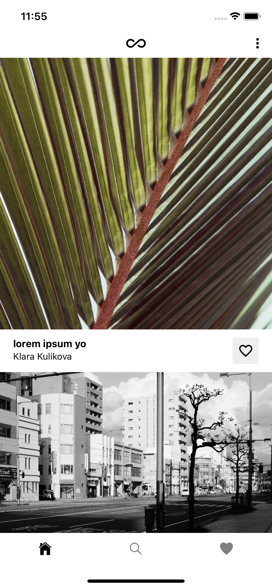
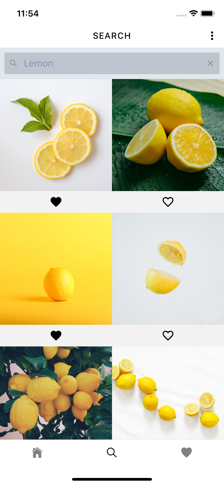

# React Native Elements

An example React Native app using the Unsplash API, Typescript, Redux and React Native Elements.

## Screenshots

| Home                                            | Search                                            |
| ----------------------------------------------- | ------------------------------------------------- |
|  |  |

## Installation

Clone the repository:

```
git clone --depth=1 git@github.com:nathan-kansu/elements.git <YOUR_PROJECT_NAME>
```

## Setup

Install project dependencies:

```
npm install
```

## Development

Starts the Metro bundler and allows you to run app in an iOS or Android phone simulator.

```
npm run start
```

## License

This project is licensed under the MIT License.
